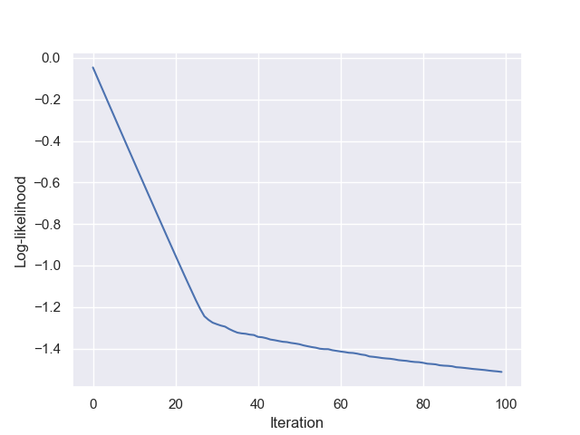
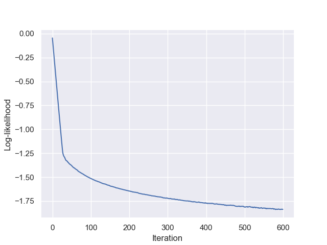

# Computational protein Design by Duplication and Divergence (C3D)
C3D is a coevolution-based method to generate candidate mutants with orthogonal binding properties. The approach relies on modelling the probability distribution of a joint multiple-sequence alignment of two interacting proteins, followed by Monte-Carlo sampling and candidate mutants selection.

The full description of the method can be found in the [original publication](#here).

**Table of content**
  1. [Installation & Requirements](#installationrequirements-1)	
  2. [Basic usages](#basic-usages)
  3. [File formats](#file-formats)
  4. [Utility functions](#utility-functions)
  5. [Tutorial](#tutorial)

**Citation**

Paper citation when available.

# Installation & Requirements
To compile and run C3D, a working MPI library must be installed. A C++ compiler supporting at least the C++17 standard is required.
C3D has been tested using [OpenMPI](https://www.open-mpi.org/) on macOS and Ubuntu.

To compile the software, run

```shell
$ make
```
from the root C3D folder. This creates a single executable c3d, which is used to perform the different generation and analysis steps (see a [worked-out example](#tutorial)). 

To use the utility python scripts in the ```utilities``` folder, python dependencies can be installed by
```shell
$ pip3 install -r requirements.txt
```

# Basic usages
C3D is built around three execution modes: Model training, sample generation and sample selection. The -h option displays the available options for any mode.

```shell
$ ./c3d -h
	
Usage: c3d mode [options]
Available modes are: train, generate, select
No execution mode provided. Exiting.
```
## Training mode
Train a generalized potts model (the global statistical model) to sequences in a multiple-sequence alignment. To convert the sequences in the appropriate format, use the fastaToMatrix.py utility (see [Utility Functions](#utility-functions)). The training is performed by approximate minimization of an L2-regularized log-likelihood function. The gradient is estimated by Markov-Chain Monte-Carlo sampling at each iteration (Boltzman-learning approach). To run **X** parallel replicas to estimate the gradient, run

```shell
$ mpirun -N X c3d train -f samplesFile [options]
```
Available options are 
```shell
$ ./c3d train -h

Usage: c3d train -f samplesFile [options]
      -f       : Input file for learning (space-delimited raw format)
      -N       : Total number of sweeps to perform [default 10000]
      -n       : Number of sweeps between recording two samples [default 10]
      -p       : Potts model starting parameters file in prm format
      -o       : Output prefix for saving files [default "output"]
      -b       : Number of iterations of the BLM optimization [default 1000]
      -l       : Regularization parameter lambda [default 0.01]
      -r       : Learning rate eta [default 0.01]
      --seed   : Random number generator seed [default 0 == time].
```

## Generation mode
Generate sample from the global statistical model by constraint Markov-Chain Monte-Carlo sampling. The sampling can be restricted to using only a subset of all positions (-pi option). The -m and -m2 options define how many mutations are to be made on the first (resp. second) protein. The  -ns option indicates where the first protein end in the concatenated alignment. The constraint sampling ensures that each generated sample has m (resp. m2) mutations on the first (resp. second) protein.

Available options are 

```shell
$ ./c3d generate -h
	
Usage: c3d generate -f nativeFile -p prmFile [options]
      -f       : Native sample file (space-delimited one-line sample file)
      -p       : Potts model parameters file in prm format
      -M       : Number of mutants to compute. [default 100]
      -m       : Number of point mutations per mutant [default 0]
      -m2      : Number of point mutations per mutant on the second protein [default 0]
      -T       : Virtual scaling temperature in the MCMC sampling [default 1].
      -o       : Output prefix for saving files [default "output"]
      -pi      : List of positions (0-based indexes) onto which to restrict the mutations [default None]
      -ns      : Last index (inclusive, 0-based) of the first protein
                 used for protein split E computation.  [default None]
      -n       : Number of sweeps between recording two mutants [default 10]
      --seed   : Random number generator seed [default 0 == time].
```
## Selection mode
Select candidate mutants with potential for being orthogonal. The selection criteria is the probability threshold, i.e. the fraction of mutants lying in the north-east quadrant of the non-cognate energies (see paper). The absolute thresholds are found by iterative line search.

Available options are 
```shell
$ ./c3d select -h

Usage: c3d select -f mutantsFile -t probThreshold [options]]
      -f       : Mutants file, as output by c3d generate (comprising mutations and energies).
      -t       : Probability threshold (in [0,1]) to select orthogonal mutants.
      -o       : Output prefix for saving files [default "output"]
```

# File formats
## Input sequences
Input sequences are encoded using a numeric format, mapping the 20 amino-acid and the gap symbol to integers 0-20 by
```shell
	-  A  C  D  E  F  G  H  I  K  L  M  N  P  Q  R  S  T  V  W  Y
	|  |  |  |  |  |  |  |  |  |  |  |  |  |  |  |  |  |  |  |  |
	0  1  2  3  4  5  6  7  8  9  10 11 12 13 14 15 16 17 18 19 20
```

A single sequence is encoded as a space-delimited line, containing each amino-acid (or gap) in its numerical form.
As an example, the sequence **ACKPRY** would be encoded as **1 2 9 13 15 20**.

A multiple-sequence alignment file is formed by writing a single sequence per line using this format. All sequences in an MSA must have the same number of amino-acids.
The [fastaToMatrix.py and matrixToFasta.py](#utility-functions) utilities convert between fasta and the internal format.
## Model parameters .prm file
The parameters of a trained model are saved in .prm files. These files can be used to either extend the training or to generate candidate new mutants by sampling the model defined by these parameters.

For a model defined over an alignment having *N* positions, the model parameters are composed of *21N* local biases and *21<sup>2</sup>N(N-1)/2* couplings (see [Methods of the paper](#here) for exact model declaration).

The prm file is organized into three parts. A header line, the local biases section and the couplings sections. No delimiter separates the sections.

The header is composed of one line, containing three space-delimited fields.
The first is a free text field for description. The second defines the number N of positions in the model, and the third defines the number of symbols in each position (by default 21 = 20 AA + 1 gap symbol).

The fields section contains *21N* lines, each composed of 3 space-delimited fields. The first field defines the positions i, the second the amino-acid index A (in [0,20]) and the third the value of the bias h<sub>i</sub>(A)

The couplings section contains *21<sup>2</sup>N(N-1)/2*, each composed of 5 space-delimited fields. The first field defines the position i, the second the position j (j>i), the third field contains the amino-acid index B (in [0,20]) of the amino-acid in position i, the fourth field contains the amino-acid index B (in [0,20]) of the amino-acid in position j and the fifth field contains the value of the coupling parameter J<sub>ij</sub>(A,B).

See [an example prm file here](tutorial/example/example.prm). This is a small toy model defined over 7 amino-acid positions.

## Position constraint file

During the sampling step, we can restrict the mutations to be applied only to a subset of positions with the -pi option.
To define which positions are allowed to be mutated, this option takes as argument a flat text file, containing a list of position indexes (0-based), corresponding to the MSA numbering used to build the model. Each line of the file contains a single index of a mutable position.

Note that the constraints of mutable positions must be consistent with the constraint of the number of mutations to introduce on the two proteins. In particular, the number of mutable positions on each protein A and B must be equal or larger than the number of mutations to be introduced, specified by the -m and -m2 options.

See [an example position file here](tutorial/example/positions.dat). Mutant generation is here restricted to positions between indexes 15 and 25.

## Mutants file
A mutants file, as generated by c3d generate, is a flat file containing one mutant per line. The mutants file has a #-leading header line defining the various fields.
Each mutant is defined by tab-delimited fields. The first m fields contain the mutations on protein A (if applicable), the next m2 fields contain the mutations on protein B (if applicable) and the last 5 fields contain the mutants energy scores.

Each mutation field is of the form OrigAA_Position_MutatedAA, where OrigAA is the (numerically encoded) index of the amino-acid in the native sequence, global position is the (zero-based) position of the mutation **in the MSA**, and MutatedAA is the (numerically encoded) idnex of the amino-acid of the mutant. The last 5 fields contain the following normalized energy scores (see paper Methods section for exact definitions): ΔE<sub>IntraA*</sub>,  ΔE<sub>IntraB*</sub>,  ΔE<sub>Inter(A*,B*)</sub>,  ΔE<sub>Inter(A*,B)</sub>,  ΔE<sub>Inter(A,B*)</sub>.

See [an example mutants file here](tutorial/example/example_orthoEs.dat). This file contains mutants with 3 mutations on protein A and 5 on protein B.
# Utility functions
To pre- and post-process the data into a format usable by c3d, a set of utility functions are availble in the ```utilites``` folder.

### fastaToMatrix.py
Converts an MSA from fasta to the internal sequence format used by c3d [describe here](#input-sequences)
```shell
Usage: python3 fastaToMatrix.py msa.fasta msa.dat
```

### matrixToFasta.py
Converts an MSA the internal sequence format used by c3d [describe here](#input-sequences) to fasta format.
```shell
Usage: python3 matrixToFasta.py msa.dat msa.fasta
```

### prmToIsing.py
Convert the model parameters to the zero-sum (Ising) gauge (see paper Methods or [Ekeberg2013](https://journals.aps.org/pre/abstract/10.1103/PhysRevE.87.012707)) for details.
```shell
Usage: python3 prmToIsing.py model.prm model_ising.prm
```

### convertMutants.py
Converts generated mutants from internal format (described [here](#mutants-file)) to human-readable format and creates a fasta file of all mutant sequences.
```shell
Usage: python3 convertMutants.py mutants.dat native.dat converted
```

# Tutorial
We will here illustrate the complete pipeline to train the model, generate candidate mutants and select mutants with potential for orthogonal interactions. The files used here can be found in the ```tutorial``` folder.
This folder contains 3 files. A multiple-sequence alignment containing homologs of concatenated pairs of interacting proteins A and B (msa.fasta), the concatenated native sequences A and B for which we wish to generate mutants (native.fasta) and an optional file restricting the positions onto which to introduce mutations (positions.dat)

In the following, we will use a toy MSA defined over 63 positions to build our model. We will (artificially) define that the 30 first positions correspond to protein A and the 33 last positions to protein B.

The first necessary step is to convert the MSA from fasta to a format usable by c3d. The fastaToMatrix.py utility serves this purpose

```shell
$ python3 utilities/fastaToMatrix.py tutorial/msa.fasta msa.dat
```

We can now build the statistical model using the converted MSA. To this aim, we call c3d with the train mode. 
```shell
$ mpirun -N 4 c3d train -f msa.dat -N 5000 -b 100 -o model
```
This trains a model using 4 parallel replicas for estimating the gradient (mpirun -N 4), computing 5000 sweeps per iteration (-N option) and performing the likelihood maximization for 100 iterations (-b option).

Two output files are generated: model.prm contains the optimized model parameters and model.log contains information regarding the optimization procedure. We can plot the evolution of the likelihood from the log file (second column).

<p align="center">

</p>

We see that the optimization has not quite converged, so let's extend the optimization for another 500 steps.
```shell
$ mpirun -N 4 c3d train -f msa.dat -p model.prm -N 5000 -b 500 -o model_extended
```

As the log file headers are comments, we can aggregate the logs of the two consecutive runs by simply concatenating model.log and model_extended to plot the total evolution of the optimization.

<p align="center">

</p>

While still not perfectly converged, we will use this model for the following analysis. In a practical application, we would continue the training further until reaching better convergence and use more replicas to get better gradient estimates.


Before proceeding, we will convert the model parameters to a particular form, i.e. we will shift the parameters to the Ising gauge. This helps to ensure that parameters and energies have a comparable scale (see [this paper](https://journals.aps.org/pre/abstract/10.1103/PhysRevE.87.012707) for details).

```shell
$ python3 utilities/prmToIsing.py model_extended.prm model_final.prm
```

We can now use the trained model to sample mutants from the fitted probability density. Mutants are generated by introducing a specified number of mutations in a target native sequence pair.
Before generating candidate mutants, we must again convert the (concatenated) native sequence pairs to the c3d internal format

```shell
$ python3 utilities/fastaToMatrix.py tutorial/native.fasta native.dat
```

We can now generate candidate mutants by using the generation mode of c3d.  Remember that in this example, we have the first 30 alignment positions corresponding to protein A and the last 33 to protein B. In this example, we will generate mutants with 5 mutations on protein A and 7 on protein B. Furthermore, we want to restrict the positions on which mutations can be introduced to a subset of both proteins. This is achieved by using a [position constraint file](#position-constraint-file) (tutorial/positions.dat).

Here, we will allow mutations on protein A on positions 3-10. On protein B, we will allow mutations on positions 42-45 and 54-59. Finally, to increase the variability of the generated repertoire, we will generate mutants with a sampling energy of T=2 in the MCMC scheme.

```shell
$ ./c3d generate -f native.dat -p model_final.prm -m 5 -m2 7 -pi tutorial/positions.dat -ns 29 -M 100000 -T 2.0 -o mutants
```
This generates 100000 mutants (-M option) by constraint MCMC sampling, introducing 5 mutations on protein A (-m 5) and 7 on protein B (-m2 7). We indicate where the split between the two concatenated proteins is in the alignment by the -ns option. Note that this option indicates the (0-based) index of the last position of protein A. The sampling temperature is controlled by the -T option.

This results in a [mutants file](#mutants-file) mutants_orthoEs.dat of 100K lines, containing the mutations and energy scores for each mutant.

To generate candidate orthogonal mutants, we now have to select the subsets of these mutants which have the lowest probability of forming non-cognate interaction, i.e. the mutants with the highest non-cognate interaction energies ΔE<sub>Inter(A*,B)</sub>,  ΔE<sub>Inter(A,B*)</sub> (see Methods section of the paper for details). To achieve this, we can select a fraction of mutants with the highest non-cognate energy scores in the relevant quadrant of the ΔE<sub>Inter(A*,B)</sub> vs  ΔE<sub>Inter(A,B*)</sub> plane.

Here, we will select the 5% of mutants with the highest non-cognate energy scores. This is achieved by the selection mode of c3d

```shell
$ ./c3d select -f mutants_orthoEs.dat -t 0.05 -o orthoCandidates
```
The -t option controls the fraction of mutants to extract from the extreme north-east quadrant of the non-cognate energy plot.
This generates another mutants file, containing 5000 candidate orthogonal mutants. Note that due to the finite accuracy of the line search to determine the selection threshold, the exact number of mutants can slightly fluctuate around the exact fraction.

Finally, we want to convert the mutants into a human-readable form and a fasta file containing a mutated sequence per mutant.
The convertMutants.py utility does exactly that

```shell
$ python3 utilities/convertMutants.py orthoCandidates_selected.dat native.dat final
```

This generates two processed files: final_mutants.fasta and final_mutantsAA.dat. The former is a flat fasta file containing one entry per mutant. The latter contains the formatted mutants.
It is similar to the [mutants file](#mutants-file) format, except that the individual mutations are reported using the one letter amino-acid code instead of the numerical index and the position are 1-based for convenience.